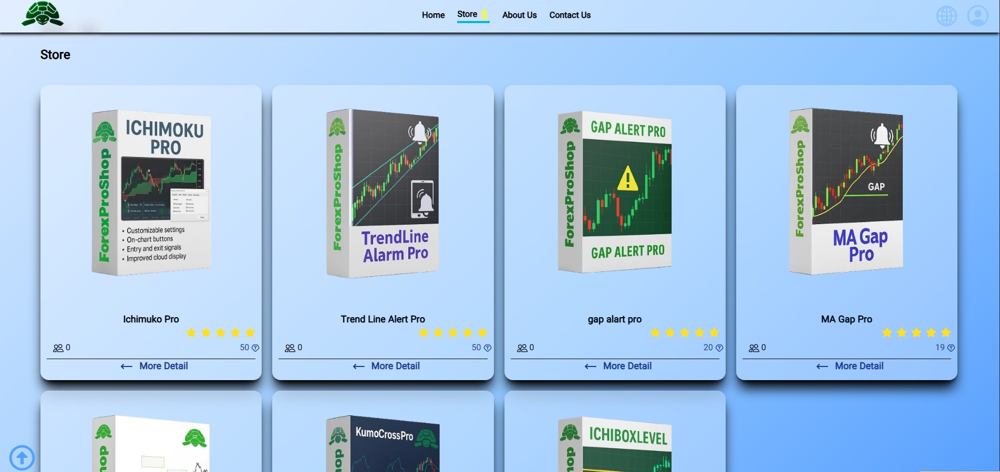
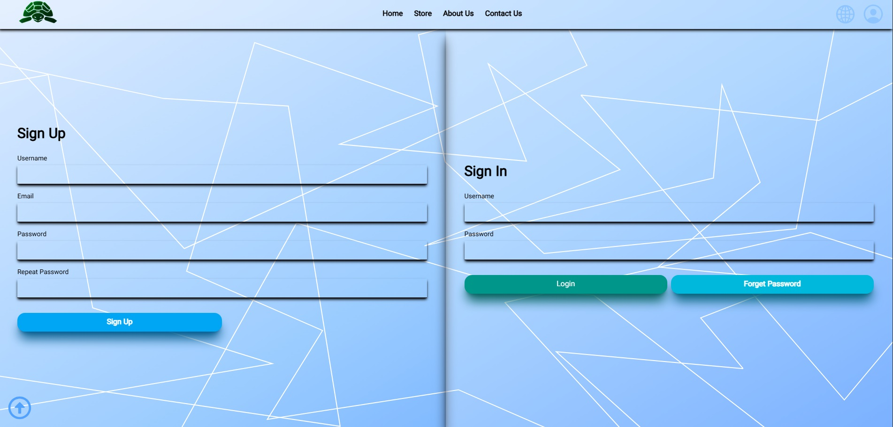
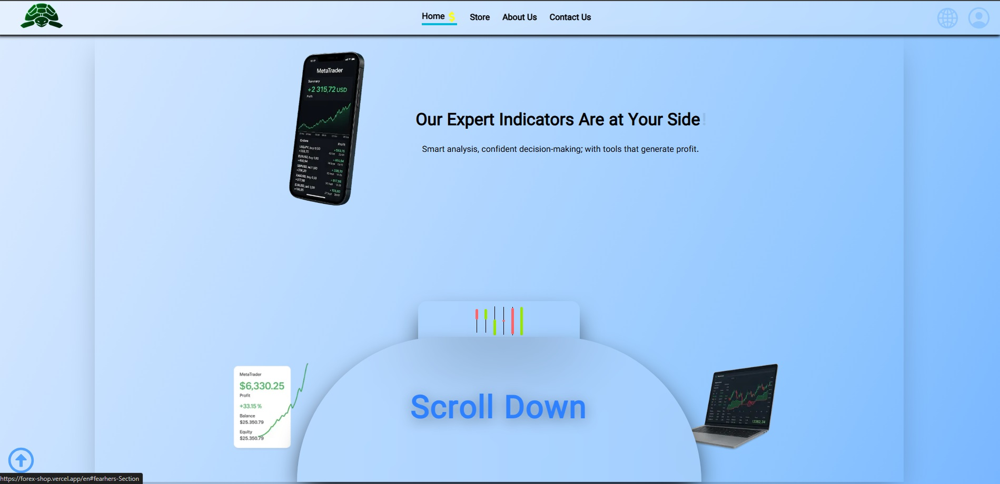

# 🛍️ ForexShop

A modern e-commerce web app for selling **custom Forex indicators** built for MetaTrader 4 & 5.
All showcased indicators are **real demo versions** designed to demonstrate their true market performance.

🔗 **Live Demo:** [forex-shop.vercel.app/en](https://forex-shop.vercel.app/en)

---

## 🚀 Features

* 💹 Real Forex indicator demos with functional previews
* 🌐 Bilingual interface (English / Persian)
* 🧩 Product pages with detailed strategy descriptions
* 💬 Direct Telegram contact for customer support
* 🔒 Manual account binding for license security
* ⚡ Optimized with Next.js server actions
* 🎨 Clean UI built with Tailwind CSS

---

## 🧠 Tech Stack


---

## ⚙️ Installation

```bash
# Clone the repository
git clone https://github.com/SadeghShojayefard/forexShop.git

# Navigate into the project
cd forexShop

# Install dependencies
npm install

# Run the development server
npm run dev
```

Now open [http://localhost:3000](http://localhost:3000) in your browser.

---

## 🖼️ Screenshots

<p align="center">
  
  
  
</p>


## 🛠️ Roadmap

* 💬 Add live chat integration
* 💳 Payment gateway support
* 📈 Expand indicator product categories
* 📊 Add user dashboard with download history

---

## 📞 Contact

<div align="center">

[](https://t.me/ForexIndicatorPro)
[](https://sadegh-shojayee-fard.vercel.app/)
[](mailto:sadegh.shojayefar@gmail.com)

</div>

---

## 🧑‍💻 Author

**Sadegh Shojayefard**
Frontend Developer | Forex Tools Creator

---

 feel free to use and modify it with credit.
